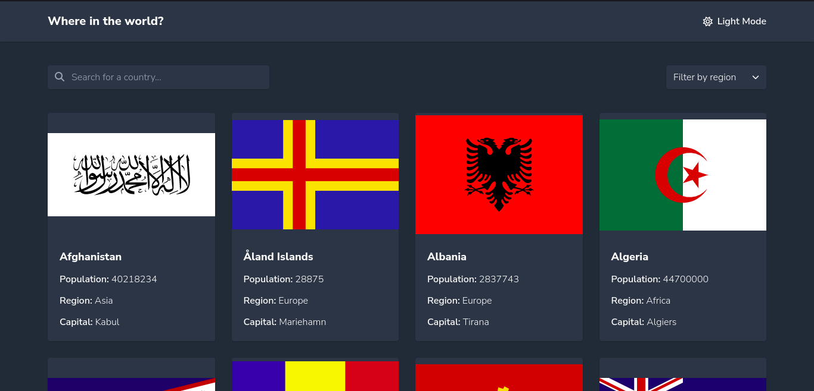

# Frontend Mentor - REST Countries API with color theme switcher solution

This is a solution to the [REST Countries API with color theme switcher challenge on Frontend Mentor](https://www.frontendmentor.io/challenges/rest-countries-api-with-color-theme-switcher-5cacc469fec04111f7b848ca). Frontend Mentor challenges help you improve your coding skills by building realistic projects.

## Table of contents

- [Overview](#overview)
  - [The challenge](#the-challenge)
  - [Screenshot](#screenshot)
  - [Links](#links)
- [My process](#my-process)
  - [Built with](#built-with)
- [What I learned](#what-i-learned)
- [Author](#author)

## Overview

### The challenge

Users should be able to:

- See all countries from the API on the homepage
- Search for a country using an `input` field
- Filter countries by region
- Click on a country to see more detailed information on a separate page
- Click through to the border countries on the detail page
- Toggle the color scheme between light and dark mode _(optional)_

### Screenshot

### Links

- Solution URL: [https://github.com/coderSuresh/rest-country-search](https://github.com/coderSuresh/rest-country-search)
- Live Site URL: [https://search-country-search.netlify.app/](https://search-country-search.netlify.app/)

## My process

### Built with

- Semantic HTML5 markup
- CSS custom properties
- Flexbox
- CSS Grid
- Tailwindcss
- Mobile-first workflow
- Vanilla JS

## What I learned

- How to use Tailwindcss
  - use Tailwindcss with vanilla JS
  - use extended colors in Tailwindcss
  - use Tailwindcss with custom CSS
- JavaScript Set
  - .add()
  - .clear()
  - .has()
- JavaScript Array
  - .filter()
  - .map()
  - .join()
  - .includes()
- JavaScript String
  - .toLowerCase()
  - .toUpperCase()
  - .includes()
  - .replace()
  - .split()
  - .slice()
  - .trim()
- JavaScript fetch API
- JavaScript async/await
- Working with JSON data
- JavaScript object
- JavaScript import/export
- Working with localStorage
  - .setItem()
  - .getItem()
- Loading in batches to improve performance
- Toggling dark mode using CSS variables and JavaScript 
- How to use Netlify to deploy a website's frontend

## Author

- Frontend Mentor - [@coderSuresh](https://www.frontendmentor.io/profile/coderSuresh)
- LinkedIn - [@coderSuresh](https://www.linkedin.com/in/codersuresh/)
